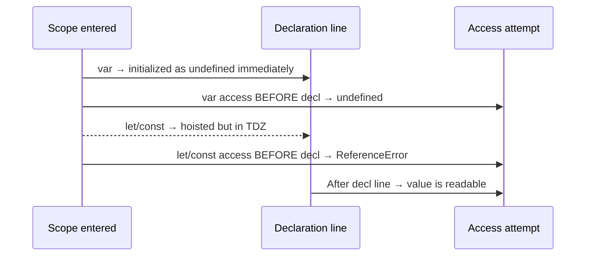

# Chapter 4 — var / let / const, Hoisting & Temporal Dead Zone

This chapter is where SDETs finally stop treating `var`, `let`, and `const` as interchangeable. We cover JavaScript variable declarations, scope rules (function vs block), hoisting behavior, the Temporal Dead Zone (TDZ), re-declaration rules, and why `const` is about binding immutability — not value immutability. Every example is small, runnable, and mapped to a real test-automation pain point.

## Files

| File | Topic | What it shows |
|------|-------|---------------|
| `09_var_let_const.js` | The three declarations | `var` redeclare/reassign, loop counter leak, function basics |
| `10_functions.js` | Function definition vs call | Define once, call many — fundamentals |
| `11_var_explained.js` | `var` is function-scoped | `var a` inside `if (true) {}` still leaks |
| `12_let_people_love.js` | `let` is block-scoped | Redeclaration error, block-isolated variables |
| `13_const_explained.js` | `const` immutability | Reassignment is a `TypeError` |
| `14_var_functionscope.js` | Function scope walkthrough | Global vs local `var` interplay |
| `15_let_scope.js` | Block scope walkthrough | Same shape as 14, but `let` behaves correctly |
| `16_Hoisting.js` | `var` hoisting | Access before declaration returns `undefined` |
| `17_hoisting_fn.js` | Hoisting inside a function | `var` hoists to function top, not global |
| `18_let_hoisting.js` | `let` + TDZ | `ReferenceError` before initialization |
| `19_let_hoisting_block.js` | Block-level TDZ | Inner `let` shadows outer, TDZ applies in block |
| `20_let_const.js` | `const` + TDZ | `const` is hoisted but un-initialized — TDZ trap |
| `21_Jr_QA.js` | Mini interview-style demo | TDZ on `const API_END_APP_VWO_COM` |

## Concepts covered

- `var` — function-scoped, hoisted to `undefined`, allows re-declaration and re-assignment (a.k.a. "the traitor").
- `let` — block-scoped, hoisted but uninitialized (TDZ), no re-declaration, re-assignment allowed.
- `const` — block-scoped, must be initialized at declaration, binding cannot be re-assigned.
- **Hoisting** — declarations are moved to the top of their scope at compile time; only `var` is auto-initialized to `undefined`.
- **Temporal Dead Zone (TDZ)** — the window between entering a scope and the actual `let`/`const` declaration line. Any access throws `ReferenceError`.
- **Re-declaration rules** — `var` allows it, `let`/`const` throw `SyntaxError`.
- **`const` is about the binding, not the value** — for objects/arrays, properties can still mutate; you just can't re-point the name.

---

### `09_var_let_const.js`

Introduces the three declarations and shows the classic `var` loop-counter leak — `i` survives outside the loop.

```js
var v = 10;
const c = 20;
let l = 30;

var browser = "chrome";
var browser = "firefox";    //redeclaration allowed
browser = "edge";           //reassignment allowed

var testCases = ["login", "logout", "signup"];

for (var i = 0; i < testCases.length; i++) {
    console.log("Running test:", testCases[i]);
}

console.log("Loop counter leaked outside:", i);

console.log("Hello");
console.log("Hello");
console.log("Hello");

function say() {
    console.log("Hi! from function");
}

say();
say();
```

```bash
Running test: login
Running test: logout
Running test: signup
Loop counter leaked outside: 3
Hello
Hello
Hello
Hi! from function
Hi! from function
```

### `10_functions.js`

Function definition vs invocation — define once, call many times.

```js
// 1. define function

function greet() {
    console.log("Hi!, I am Greet. How are you?")
}

// 2. calling the function
greet();
greet();
greet();
greet();
greet();
greet();
greet();
greet();
```

```bash
Hi!, I am Greet. How are you?
Hi!, I am Greet. How are you?
Hi!, I am Greet. How are you?
Hi!, I am Greet. How are you?
Hi!, I am Greet. How are you?
Hi!, I am Greet. How are you?
Hi!, I am Greet. How are you?
Hi!, I am Greet. How are you?
```

### `11_var_explained.js`

`var` is function-scoped — the `if` block does NOT create a new scope for `var`.

```js
var g = 10;         //global scope

// var is function scoped

console.log(g);

function printHello() {
    console.log("Hello, I am Apoorva");
    var g = 20;     //local scope
    console.log("value of ge from function ", g);
    if (true) {
        var g = 30;
        console.log("value of g from if condition ", g);        //30
    }
}

printHello();

var g = 50;
```

```bash
10
Hello, I am Apoorva
value of ge from function  20
value of g from if condition  30
```

### `12_let_people_love.js`

`let` is block-scoped; re-declaration is illegal; access outside the block fails.

```js
// let - Block Scope
let a = 10;

let retryCount = 0;
retryCount = retryCount + 1;
retryCount = retryCount + 1;
console.log("Retry Attempt: ", retryCount);

//let retryCount = 5;

//let retryCount = 5; SyntaxError: Identifier 'retryCount' has already been declared

// ❌ SyntaxError: redeclaration not allowed

let testStatus = "pending";

// let testStatus = true;

if (testStatus == true) {
    let executionTime = 1200;
    console.log("Inside block: ", executionTime);
}

// console.log(executionTime); // ReferenceError: executionTime is not defined

// {} - Block 
// if(){} 
// funcion name(){}

// let = loyal
// var = varirable / triator

let name = "pending";
name = "done";
```

```bash
Retry Attempt:  2
```

### `13_const_explained.js`

`const` binding cannot be re-assigned — TypeError on attempt.

```js
const baseURL = "https://app.thetestingacademy.com";
// const baseURL = "https://app.thetestingacademy.com";
//baseURL = "https:/ / staging.thetestingacademy.com";
// TypeError: Assignment to constant variable.

let name = "pending";
// name = done;
{
    let name = "Apoorva";
}

function say() {
    let name = "Baranwal";
}

say();
say();
```

```bash
(no output — variables declared/assigned silently)
```

### `14_var_functionscope.js`

A clean walk-through of `var` global + nested function scope.

```js
var a = 10;     //global scope
console.log(a);

function printHello() {
    console.log("Hello, I am Apoorva");
    var a = 20;     //local scope
    console.log("value of a from function ", a);        //20
    if (true) {
        var a = 30;
        console.log("value of a from if condition ", a);        //30
    }
    console.log("F-> ", a);        //30
}

console.log("value of a from global scope ", a);        //10    

printHello();
```

```bash
10
value of a from global scope  10
Hello, I am Apoorva
value of a from function  20
value of a from if condition  30
F->  30
```

### `15_let_scope.js`

Same structure, `let` instead of `var` — now block scope behaves sanely.

```js
let l = 10;     //global scope
console.log(l);

function printHello() {
    console.log("Hello, I am Apoorva");
    let l = 20;    //local scope
    console.log("value of l from function ", l);        //20
    if (true) {
        let l = 30;
        console.log("value of l from if condition ", l);        //30
    }
    console.log("value of l from function ", l);        //20
}

console.log("G ->", l);

printHello();
```

```bash
10
G -> 10
Hello, I am Apoorva
value of l from function  20
value of l from if condition  30
value of l from function  20
```

### `16_Hoisting.js`

`var` is hoisted and pre-initialized to `undefined`.

```js
// JS Engine
// LINE BY LINE, , JIT Compilation

console.log(greeting);
var greeting = "Hello";
console.log(greeting);

// Behind the scenes:

// var greeting;              <-- hoisted with undefined
// console.log(greeting);    <-- undefined
// greeting = "Hello!";      <-- assignment stays in place
// console.log(greeting);    <-- "Hello!"

// var a;
console.log(h);
var h = "Apoorva";
console.log(h);
```

```bash
undefined
Hello
undefined
Apoorva
```

### `17_hoisting_fn.js`

`var` hoists to the **function** top, not the global scope.

```js
function getUserStatus() { // JS Engine
    //var status_code; JS Engine (optimized the code)
    console.log(status_code);
    var status_code = "Active";
    console.log(status_code);
}

getUserStatus();

// Note: var is function-scoped, so status is hoisted to
// the top of getUserStatus(), NOT the global scope.
```

```bash
undefined
Active
```

### `18_let_hoisting.js`

`let` is hoisted too — but uninitialized. Welcome to the TDZ.

```js
console.log(score); // ReferenceError: Cannot access 'score' before initialization
let score = 100;


{
    // ---- TDZ for "score" starts here ----
    // console.log(score);  // ReferenceError!
    // score = 50;          // ReferenceError!
    // typeof score;        // ReferenceError!
    // ---- TDZ for "score" ends here ----
    let score = 100;        // Declaration reached, TDZ ends
    console.log(score);     // 100 (safe to access now)
}
```

```bash
ReferenceError: Cannot access 'score' before initialization
```

### `19_let_hoisting_block.js`

Block-scope shadowing creates a fresh TDZ inside the block — even though an outer `x` exists.

```js
let x = "global";

if (true) {
    // TDZ for block-scoped "x" starts here
    // console.log(x);   // ReferenceError (NOT "global"!)
    let x = "block";     // TDZ ends
    console.log(x);      // "block"
}

console.log(x);
```

```bash
block
global
```

### `20_let_const.js`

`const` is hoisted but uninitialized — accessing before declaration throws.

```js
// console.log(c); // ReferenceError: Cannot access 'c' before initialization
console.log("Hei");
console.log("Hei");
console.log("Hei");
console.log("Hei");
console.log("Hei");

const c = "pramod;";
```

```bash
Hei
Hei
Hei
Hei
Hei
```

### `21_Jr_QA.js`

Classic junior-QA interview trap — looks innocent, blows up on line 1.

```js
console.log(API_END_APP_VWO_COM);
console.log("dasda")
if (true) {

}

const API_END_APP_VWO_COM = "https://app.vwo.com/login/api";
```

```bash
ReferenceError: Cannot access 'API_END_APP_VWO_COM' before initialization
```

---

## TDZ — visual



| Declaration | Access before declaration line |
|-------------|--------------------------------|
| `var x`     | `undefined`                    |
| `let x`     | `ReferenceError` (TDZ)         |
| `const x`   | `ReferenceError` (TDZ)         |

## `var` vs `let` vs `const`

| Feature           | `var`                 | `let`                  | `const`                |
|-------------------|-----------------------|------------------------|------------------------|
| Scope             | Function              | Block `{}`             | Block `{}`             |
| Hoisting          | Yes — init `undefined`| Yes — TDZ              | Yes — TDZ              |
| Re-declaration    | Allowed               | `SyntaxError`          | `SyntaxError`          |
| Re-assignment     | Allowed               | Allowed                | `TypeError`            |
| Must initialize?  | No                    | No                     | Yes (at declaration)   |
| Global → window?  | Yes (in browser)      | No                     | No                     |

## How to run

```bash
node chapter_04_Javascript_Concepts/09_var_let_const.js
node chapter_04_Javascript_Concepts/16_Hoisting.js
node chapter_04_Javascript_Concepts/18_let_hoisting.js
# ...and so on for each file
```

## Takeaway

Default to `const`, reach for `let` only when you must re-assign, and treat `var` as legacy. Once TDZ clicks, half of "weird JS bugs" in your Playwright tests stop being weird.
